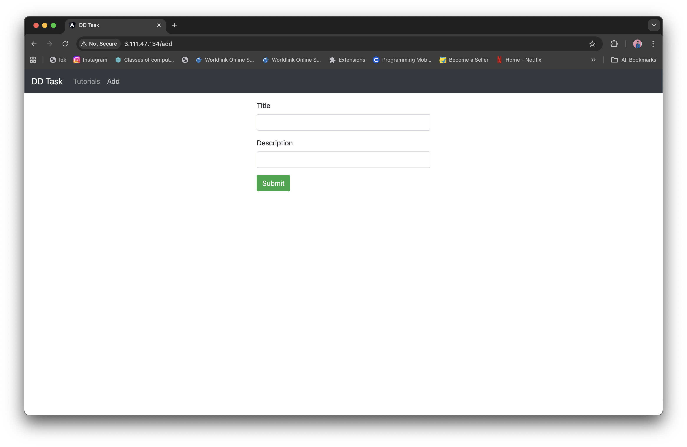
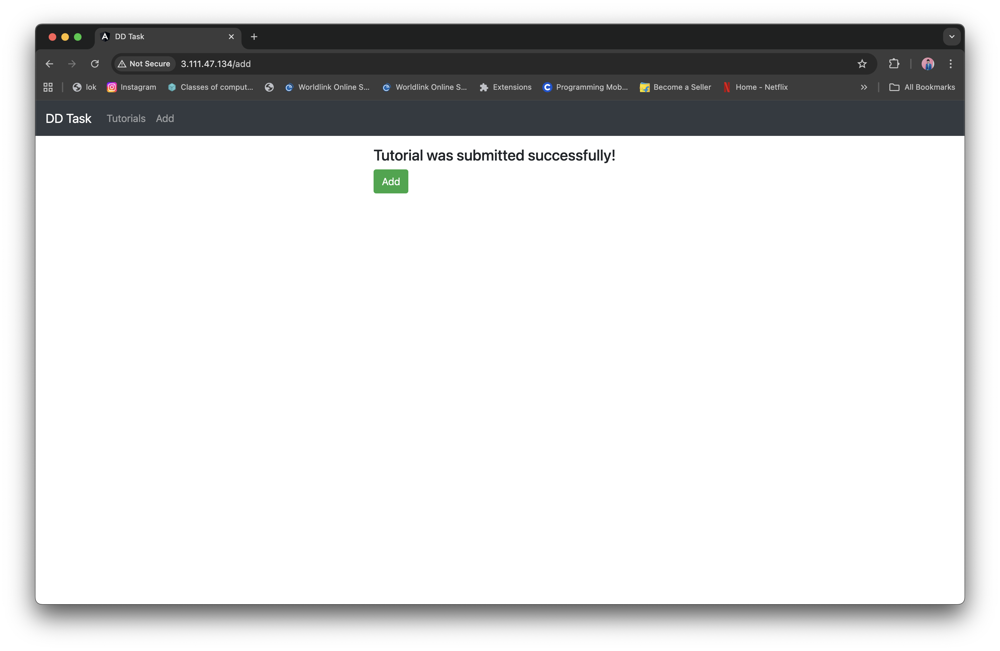
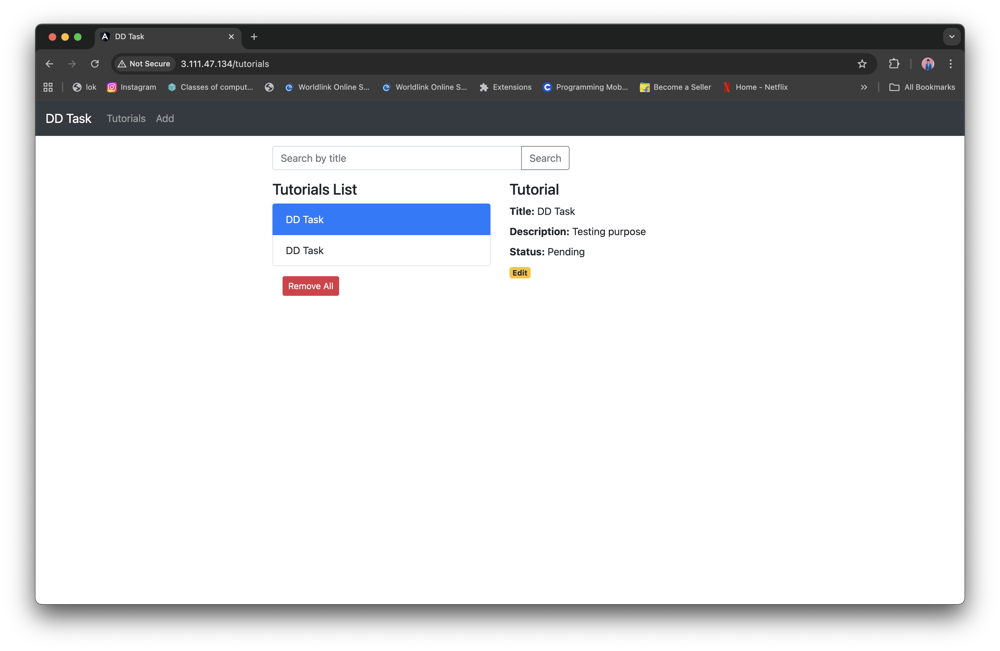

# Discover Dollar DevOps MEAN Application Deployment

A complete end-to-end DevOps assignment showcasing:

* **Containerization (Docker)**
* **Orchestration (Docker Compose)**
* **CI/CD Pipeline (GitHub Actions)**
* **Cloud Deployment (AWS EC2 Ubuntu)**
* **Reverse Proxy Setup (Nginx)**
* **Full-stack MEAN Application (MongoDB, Express, Angular, Node.js)**

This document contains:

1. Step-by-step setup instructions
2. Deployment workflow
3. Infrastructure details
4. Commands used
5. Code changes made
6. Required screenshots checklist

---

# 1️⃣ Project Structure

```
crud-dd-task-mean-app/
├── backend/
├── frontend/
├── docker-compose.yml          # Local development
├── docker-compose.prod.yml     # Production file for EC2
├── nginx/ (optional)
└── .github/workflows/deploy.yml
```

---

# 2️⃣ Local System Setup (Mac)

### Clone the repository

```bash
git clone https://github.com/Mr-DEVINE/discover-dollar-devops-mean-task.git
cd discover-dollar-devops-mean-task
```

### Install dependencies & run locally

#### Backend

```bash
cd backend
npm install
node server.js
```

* Visit: [http://localhost:8080/api/tutorials](http://localhost:8080/api/tutorials)

#### Frontend

```bash
cd frontend
npm install
ng serve --port 8081
```

* Visit: [http://localhost:8081](http://localhost:8081)

---

# 3️⃣ Docker & Docker Compose (Local)

### Build & run full MEAN stack locally

```bash
docker compose up --build
```

### Services

* Frontend → [http://localhost:8081](http://localhost:8081)
* Backend → [http://localhost:8080/api/tutorials](http://localhost:8080/api/tutorials)
* MongoDB → localhost:27017

---

# 4️⃣ Docker Hub Images

### Build images

```bash
docker build -t mrdevine/discover-dollar-backend:latest ./backend
docker build -t mrdevine/discover-dollar-frontend:latest ./frontend
```

### Push images

```bash
docker push mrdevine/discover-dollar-backend:latest
docker push mrdevine/discover-dollar-frontend:latest
```

---

# 5️⃣ AWS EC2 Setup

### Create Ubuntu EC2 instance

* Ubuntu 22.04 LTS
* t2.micro
* Allow ports: **22, 80, 8080, 8081** (8080 & 8081 optional)

### Install Docker

```bash
sudo apt update
sudo apt install -y docker.io docker-compose git
```

### Clone project inside EC2

```bash
git clone https://github.com/Mr-DEVINE/discover-dollar-devops-mean-task.git
cd discover-dollar-devops-mean-task
```

---

# 6️⃣ Production Deployment on EC2

### Run production compose

```bash
sudo docker-compose -f docker-compose.prod.yml pull
sudo docker-compose -f docker-compose.prod.yml up -d
```

### Verify

```bash
sudo docker-compose -f docker-compose.prod.yml ps
```

Containers running:

* dd-mongo
* dd-backend (port 8080)
* dd-frontend (port 8081)

Access UI:

```
http://<EC2_PUBLIC_IP>:8081
```

---

# 7️⃣ Nginx Reverse Proxy Setup (Port 80)

### Install Nginx

```bash
sudo apt install -y nginx
```

### Create config

```bash
sudo nano /etc/nginx/sites-available/discover-dollar
```

Paste:

```
server {
    listen 80;
    server_name _;

    # Frontend
    location / {
        proxy_pass http://127.0.0.1:8081;
        proxy_http_version 1.1;
        proxy_set_header Upgrade $http_upgrade;
        proxy_set_header Connection 'upgrade';
        proxy_set_header Host $host;
    }

    # Backend
    location /api/ {
        proxy_pass http://127.0.0.1:8080/api/;
        proxy_http_version 1.1;
        proxy_set_header Upgrade $http_upgrade;
        proxy_set_header Connection 'upgrade';
        proxy_set_header Host $host;
    }
}
```

### Enable site

```bash
sudo rm /etc/nginx/sites-enabled/default
sudo ln -s /etc/nginx/sites-available/discover-dollar /etc/nginx/sites-enabled/
sudo nginx -t
sudo systemctl reload nginx
```

### Access Application

```
http://<EC2_PUBLIC_IP>
```

---

# 8️⃣ GitHub Actions CI/CD Setup

### Add repository secrets

| Secret Name     | Value                     |
| --------------- | ------------------------- |
| DOCKER_USERNAME | `mrdevine`                |
| DOCKER_PASSWORD | Docker Hub password/token |
| SSH_USER        | ubuntu                    |
| HOST_IP         | EC2 public IP             |
| SSH_PRIVATE_KEY | Contents of your .pem key |

### Workflow file: `.github/workflows/deploy.yml`

*(Full file already in repo)*

Deployment logic:

1. Build backend image → push to Docker Hub
2. Build frontend image → push to Docker Hub
3. SSH into EC2
4. Stop old containers
5. Pull latest images
6. Start new containers

---

# 9️⃣ Important Code Fixes

## Fix 1 — Angular API base URL (important for Nginx)

Updated in:

```
frontend/src/app/services/tutorial.service.ts
```

**Old:**

```
const baseUrl = 'http://localhost:8080/api/tutorials';
```

**New:**

```
const baseUrl = '/api/tutorials';
```

## Fix 2 — Production docker-compose uses Docker Hub

`docker-compose.prod.yml`:

```
backend:
  image: mrdevine/discover-dollar-backend:latest

frontend:
  image: mrdevine/discover-dollar-frontend:latest
```

## Fix 3 — CI/CD deployment improvement

Added container recreation in `deploy.yml`:

```
sudo docker-compose -f docker-compose.prod.yml down
sudo docker-compose -f docker-compose.prod.yml pull
sudo docker-compose -f docker-compose.prod.yml up -d --remove-orphans
```

---

# 🔟 Required Screenshots (as per assignment)

You must include these in your submission:

### ✅ 1. CI/CD Pipeline

* GitHub Actions workflow run
* Build logs
* Deployment logs

### ✅ 2. Docker Build & Push

* Local or CI logs showing images created
* Docker Hub repository screenshot

### ✅ 3. Application Deployment

* EC2 instance running `docker-compose.ps`
* Logs from backend
* Browser showing working UI on port 80

### ✅ 4. Nginx Setup

* `/etc/nginx/sites-available/discover-dollar` config screenshot
* Nginx reload success message

### ✅ 5. Infrastructure

* AWS EC2 instance page
* Security groups (port 80 open)

---

# 🎯 Final Output

After deployment, your app is fully accessible at:

```
http://<EC2_PUBLIC_IP>
```

Complete MEAN application with:

* Working CRUD
* Reverse proxy
* Fully automated CI/CD
* Cloud deployment
* Dockerized setup

---

# 🎉 End of Documentation

This completes your Discover Dollar DevOps Engineer Intern assignment.
To submit: include this README + GitHub repo link + screenshots.

# 📷 Screenshots

Below are the screenshots required for submission. Replace the file paths with your uploaded images when adding them to GitHub.

### 1. Add Tutorial Page



### 2. Tutorial Submitted Successfully


### 3. Tutorials List Page



### 4. CI/CD Workflow Success



### 5. CI/CD Workflow Runs List


### 6. CI/CD Detailed Success View


